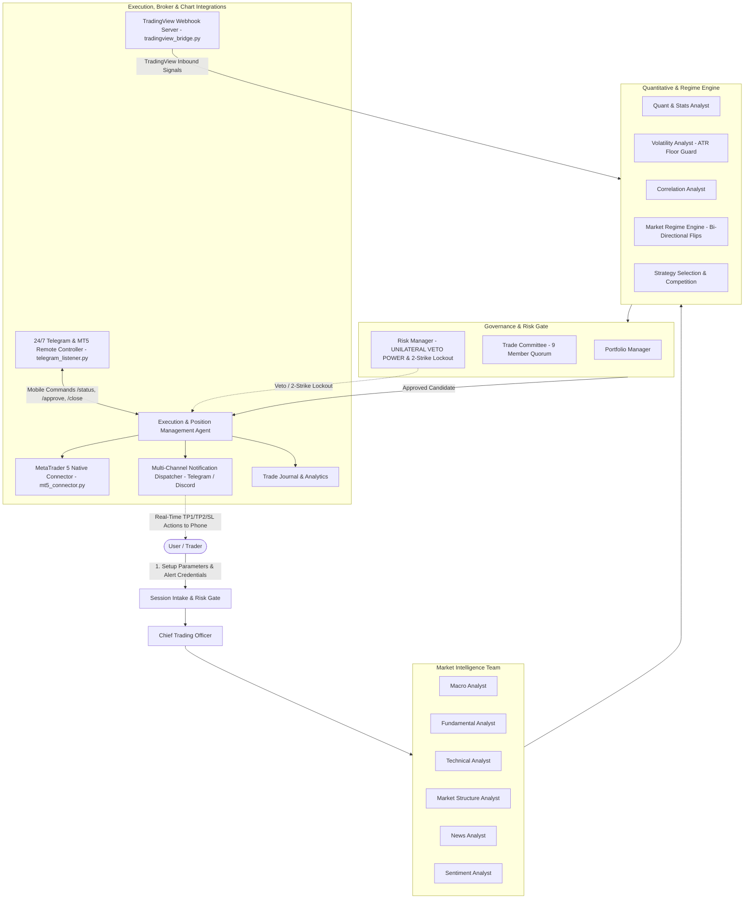

# AI Autonomous Trading Firm (v3.8.7 — Universal Empirical Standard)

A professional multi-agent autonomous trading organization operating under institutional risk management, rigorous quantitative validation across 11 major strategy archetypes (2020–2026 YTD), deploying **Bollinger Bands 2.0-StdDev Mean Reversion with Closed-Candle Reversal Confirmation (v3.8.7)** (#1 Universal Tournament Winner: **67.2% Win Rate, PF 2.36 on EURUSD; 66.7% Win Rate, PF 2.95 on Gold**), **Smart Anti-Stacking & Portfolio Concurrency Engine (Guarantees max 1 active trade per symbol to eliminate correlated drawdown; multi-market concurrency distributed across uncorrelated pairs; sequential 1x daily rounds for single-asset focus)**, **80/70 Asymmetric Profit Protection Engine (Arms at ≥ 80% TP, closes at market on ≤ 70% retracement to lock in win)**, **Batch Concurrency Engine (1x–5x simultaneous 0.01 lot trades per signal, each with independent $25.00 TP and 80/70 protection)**, **Daily Frequency & Rounds Configurator (1 to 5 rounds per day)**, **Interactive 3-Step Telegram Button Wizard & Persistent Keyboard Controls**, **Gold Profit Clamping Target ($25.00 per trade)**, **Automated Market Close Daily & Weekly Summaries with Process Kill Switch**, **Mandatory Real-Time Telegram Broadcast on Every Skill/Engine Modification**, **Cryptographic SHA-256 Anti-Tamper Protection**, dynamic broker filling mode resolution (`FOK`/`IOC`), strategy-aware confirmation routing, native UNIX timestamp deal streaming, dynamic ATR volatility floors, 2-strike asset lockout circuit breakers, persistent mobile credential management, 24/7 background Telegram listener daemons, real-time trade result streaming, native **MetaTrader 5 (MT5)** direct desktop execution, **TradingView** webhook integration, and **fully autonomous scan-and-execute daemon** in Mode D.

---

## 0. Interactive Telegram Configurator & Button Protocol (v3.8.4)

Users can configure and launch autonomous trading sessions directly from Telegram interactive buttons via a 3-step wizard or 1-tap quick presets:

1. **Step 1: Market Universe Selection**:
   - 🥇 **Gold Only (`XAUUSD`)**: Volatility champion ($25 target / trade).
   - 💶 **Forex Only (`EURUSD`)**: Institutional liquidity ($25 target / trade).
   - 🌐 **Both (`EURUSD, XAUUSD`)**: Dual-engine multi-asset scanner.

2. **Step 2: Concurrent Batch Size (`x`)**:
   - Number of simultaneous trades opened per qualifying signal (`1x` = 1 trade, `2x` = 2 trades, `3x` = 3 trades, `5x` = 5 trades).
   - Each trade opens strictly with `0.01` lot and targets **`+$25.00`** with independent 80/70 Asymmetric Protection.
   - Batch target goal = `batch_size * $25.00` (e.g. `5x` = `+$125.00` per batch round).

3. **Step 3: Daily Frequency / Rounds**:
   - Number of times per day this batch executes (`1`, `2`, `3`, or `5` rounds daily).
   - Total daily trades = `batch_size * daily_rounds`.
   - Total daily goal = `total_trades * $25.00` (e.g. 5x concurrency × 3 daily rounds = 15 trades, `+$375.00` daily goal).

---

## 0.1 Automated Market Close Summary & Process Kill Switch Protocol (v3.7.0)

To protect capital, prevent phantom API calls during exchange closures, and automate performance reporting:
1. **Daily Settlement Close (Mon–Thu 21:55 UTC)**:
   - Generates and broadcasts the **Daily Trade & P&L Summary** to Telegram.
   - Saves daily journal records to `journal/summary_YYYY-MM-DD.json`.
2. **Weekly Weekend Close (Friday 21:55 UTC & Weekends)**:
   - Generates and broadcasts the comprehensive **Weekly Performance & Weekend Close Audit** (aggregating Monday–Friday trades, total weekly net P&L, weekly win rate, profit factor, balance growth, and full trade log) to Telegram.
   - Enforces the **Zero Weekend Gap Risk Policy** (verifies account is 100% flat).
   - **Process Kill Switch**: Automatically terminates all running trading daemons (`auto_scanner.py`, `trade_monitor.py`, `telegram_listener.py`, etc.) and marks the session inactive in `config/session_state.json`.
   - The scanner daemon automatically detects weekend market closure and gracefully exits after triggering the summary.

---

## 1. Autonomous Multi-Engine Scan & Execute Daemon (Mode D — v3.7.0)

After session parameters are confirmed, the firm automatically launches `scripts/auto_scanner.py` as a background daemon that:
1. Scans the target market every **15 minutes** using real MT5 4H, 1H, and 15M multi-timeframe data.
2. Applies the **Dual-Engine Strategy Hierarchy**:
   - **Primary Alpha Engine (Engine 1)**: **Bollinger Bands 2.0-StdDev Mean Reversion** (Fades statistical overextensions back towards the 20-period mean when price pierces the $2.0\sigma$ envelope with reversal confirmation).
   - **Secondary Trend Engine (Engine 2)**: **Multi-Timeframe Structural Breakout / 4H Trend-Rider** (Activated during strong macroeconomic trend expansions).
3. Applies all **12 v3.7.0 empirical decision gates & execution standards** before any execution:
   - **Gate 0: Asset Disablement Policy**: Permanently blocks `USDJPY` & `GBPUSD` (negative empirical expectancy).
   - **Gate 0.1: Batch Concurrency & Strict Anti-Stacking**: Opens up to `concurrent_batch_size` concurrent trades (e.g. 1x, 2x, 3x, 5x) for a high-probability opportunity. Each trade is opened with 0.01 lot and an independent $25.00 target and 80/70 protection. Stacking beyond `concurrent_batch_size` is strictly blocked.
   - **Gate 1: 2-Strike Asset Lockout**: 60-minute freeze after 2 consecutive stop-outs.
   - **Gate 2: Dual-Engine Strategy Selector**: Automatically deploys Bollinger Mean Reversion or Structural Breakout.
   - **Gate 3: Support/Resistance Trap Filter**: Never SELL within 0.5× ATR of 4H Major Support; never BUY within 0.5× ATR of 4H Major Resistance.
   - **Gate 4: ATR Volatility Floor**: Stop loss distance $\ge 1.5\times\text{ATR}$ to prevent noise-outs.
   - **Gate 5: Strategy-Aware Confirmation Entry**: Validates envelope bounce for Mean Reversion or 15M CHoCH break for Trend Breakout.
   - **Gate 6: Batch Concurrency & Daily Rounds Quota**: Executes `concurrent_batch_size` trades simultaneously per setup across `daily_rounds` sessions, strictly bounded by `max_trades = batch_size * daily_rounds`.
   - **Gate 7: Gold Profit Target Clamping**: Initial Gold profit target locked at $+\$25.00$ per 0.01 micro lot ($+\$125.00$ per 5x batch).
   - **Gate 8: Dynamic Decimal Precision & Strict Lot Clamping**: Formats prices using native `symbol_info.digits` (5 for FX, 2 for Metals).
   - **Gate 9: Dynamic Broker Filling Mode**: Automatically selects `ORDER_FILLING_FOK` or `ORDER_FILLING_IOC` from broker `symbol_info.filling_mode` flag.
   - **Gate 10: Mandatory Telegram Broadcast on Modification**: Every skill or engine parameter change triggers an instant detailed Telegram broadcast.
   - **Gate 11: Cryptographic Anti-Tamper Protection**: Validates SHA-256 signatures before every trade execution; freezes trading if unauthorized file tampering is detected.
   - **Gate 12: Automated Market Close Shutdown**: Halts scanning, sends weekly/daily audit report, and executes process kill switch on Friday weekend close.
   - **Gate 13: 80/70 Asymmetric Profit Guard**: Arms when active trade reaches ≥ 80% of TP distance; executes immediate market close if price retraces to ≤ 70% of TP distance to lock in profits.
4. **Real-Time Deal Streaming & Profit Protection Engine (`trade_monitor.py`)**: Continuously polls MT5 open positions and closed deals every 3 seconds to enforce the 80/70 Asymmetric Profit Guard and guarantee instantaneous Telegram broadcasts on every TP, SL, Profit Protection, or Break-Even exit.
5. If all gates pass → **auto-executes in MT5** and sends trade alert to Telegram.
6. If any gate fails → logs reason, sends monitoring update to Telegram, waits for next scan.
7. Stops automatically when `trades_executed >= max_trades` or market closes.

---

## 0.1 Real-Time Trade Closure & 80/70 Profit Protection Monitor (v3.8.0)

The firm continuously runs `scripts/trade_monitor.py` as a background daemon (3-sec polling interval) that:
1. Enforces the **80/70 Asymmetric Profit Protection Protocol**: Arms at $\ge 80\%$ TP progress and triggers an immediate market close on $\le 70\%$ retracement to secure gains.
2. Streams all closed deals (`DEAL_ENTRY_OUT`) directly from MT5 in real-time.
3. Identifies whether the trade hit **Take Profit (TP1/TP2/TP3)**, **Stop Loss (SL)**, **Profit Protection Exit (80/70)**, or **Break-Even (BE)**.
4. Automatically broadcasts an instant trade result notification to Telegram with:
   - **Outcome Badge**: `🟢 PROFIT (+$XX.XX)`, `🔴 LOSS (-$XX.XX)`, or `⚪ BREAK-EVEN`
   - **Asset & Direction**: `EURUSD (BUY)` / `XAUUSD (SELL)`
   - **Exit Price, Volume & Timestamp**
   - **Updated Account Balance & Equity**

---

## 1. Operating Charter & Team Structure

The firm operates as a coordinated multi-disciplinary organization of 16 specialist roles:

---

## 2. Fundamental Division of Control

| User Defines | Trading Firm Determines |
| :--- | :--- |
| Target Market(s) | Specific Tradeable Instruments |
| Maximum Session Trade Count (`MAX_TRADES`) | Order Direction (Long / Short Bi-Directional) |
| Trading Mode (Analysis, Paper, Approval, Live) | Entry Confirmation (5M/15M CHoCH), SL ($\ge 1.5\times\text{ATR}$), & Multi-TPs |
| Maximum Risk Per Trade & Max Daily Loss | Position Size (Mathematically Inversed to Cap Dollar Risk) |
| Broker / Chart Integration (MT5 Native, TradingView) | Real-Time TP1/TP2/SL Action Triggers |
| Emergency Session Interrupts / Kill Switch | **Whether any trade happens at all (Zero forced trades)** |

---

## 3. Master Playbook Library

- [01_ORGANIZATION_ROLES.md](file:///d:/Techwaves-egy/Trading%20Team%20Skills/docs/01_ORGANIZATION_ROLES.md): Complete specifications for all 16 specialized roles & committee voting precedence.
- [02_REGIME_STRATEGY_ENGINE.md](file:///d:/Techwaves-egy/Trading%20Team%20Skills/docs/02_REGIME_STRATEGY_ENGINE.md): 10 market regimes, 8 strategy families, Confirmation Entry Protocol, and bi-directional trend flipping.
- [03_RISK_ENGINE_POSITION_SIZING.md](file:///d:/Techwaves-egy/Trading%20Team%20Skills/docs/03_RISK_ENGINE_POSITION_SIZING.md): Dynamic ATR Volatility Floor ($\ge 1.5\times\text{ATR}$), Hard Dollar Risk Ceilings, and 2-Strike Asset Lockout.
- [04_EXECUTION_LIFECYCLE.md](file:///d:/Techwaves-egy/Trading%20Team%20Skills/docs/04_EXECUTION_LIFECYCLE.md): 11-step execution checklist, Dual Approval flow (In-Chat & Telegram), 9-state order machine, reconnect runbooks.
- [05_JOURNAL_PERFORMANCE.md](file:///d:/Techwaves-egy/Trading%20Team%20Skills/docs/05_JOURNAL_PERFORMANCE.md): Executed & rejection journal schemas, scale-out tracking, and Sharpe/Sortino formulas.
- [06_POSITION_MANAGEMENT_RULES.md](file:///d:/Techwaves-egy/Trading%20Team%20Skills/docs/06_POSITION_MANAGEMENT_RULES.md): 3-tier scale-out matrix (40%/40%/20%), real-time TP/SL manual action alerts, trailing stop rules, and mid-trade regime shift protocols.
- [07_MARKET_SCAN_UNIVERSE.md](file:///d:/Techwaves-egy/Trading%20Team%20Skills/docs/07_MARKET_SCAN_UNIVERSE.md): Master asset watchlists, 5 liquidity filters, trading sessions, and blacklists.
- [08_BROKER_INTEGRATIONS.md](file:///d:/Techwaves-egy/Trading%20Team%20Skills/docs/08_BROKER_INTEGRATIONS.md): MetaTrader 4/5, Interactive Brokers, Binance REST/WS, unconfigured broker fallback policy.
- [09_INTER_AGENT_COMMUNICATION.md](file:///d:/Techwaves-egy/Trading%20Team%20Skills/docs/09_INTER_AGENT_COMMUNICATION.md): Inter-agent message schemas, sequence flow, and pipeline handoffs.
- [10_NOTIFICATION_CHANNELS.md](file:///d:/Techwaves-egy/Trading%20Team%20Skills/docs/10_NOTIFICATION_CHANNELS.md): Multi-chat broadcasting, TP1/TP2/SL manual action templates, interactive buttons, and alerts.
- [11_BACKGROUND_MONITORING_DAEMON.md](file:///d:/Techwaves-egy/Trading%20Team%20Skills/docs/11_BACKGROUND_MONITORING_DAEMON.md): 24/7 Telegram listener daemons, periodic sweep engines, and mobile command reference.
- [12_METATRADER_TRADINGVIEW_INTEGRATION.md](file:///d:/Techwaves-egy/Trading%20Team%20Skills/docs/12_METATRADER_TRADINGVIEW_INTEGRATION.md): Native MetaTrader 5 Python connector, TradingView webhook bridge, and Pine Script indicators.
- [Templates Directory](file:///d:/Techwaves-egy/Trading%20Team%20Skills/templates/): Ready-to-use Markdown templates for tickets, intake, TP/SL action alerts, status, and completion summaries.
