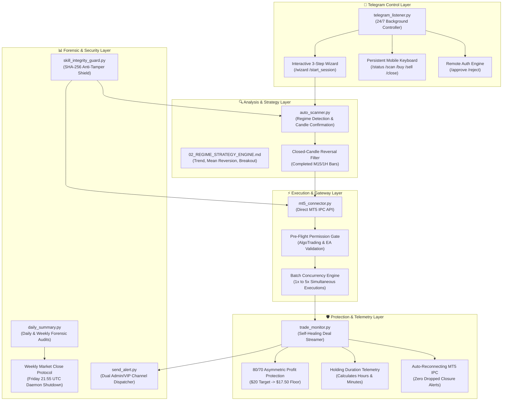

# AI Autonomous Trading Firm — Master Work Log & Continuity Dossier (`WORK_LOG.md`)

> **Institutional Continuity Notice:** This document is the single source of truth for the AI Autonomous Trading Firm repository. It provides any successor AI agent, quant researcher, or software engineer with a complete record of system architecture, chronological milestones, past forensic diagnoses, mathematical models, operational protocols, and current live status.

---

## 📌 Executive Summary & Live System Status

* **Firm / Skill Name:** AI Autonomous Trading Firm (`techwaves-egy/trading-team-skills`)
* **Current Architectural Version:** `v3.9.0` (Tag: `v3.9.0`)
* **Repository Working Branch:** `master` (Synchronized with `origin master`)
* **Active Broker / Execution Gateway:** MetaTrader 5 Desktop IPC (`MetaQuotes-Demo`)
* **Live Target Account:** `#113155651`
* **Account Balance & Equity:** **`$1,026.66`** (100% Capital Preserved, Net Weekly Profit: `+$26.66` / `+2.66%`)
* **Open Market Exposure:** **`0` Positions (100% Flat)**
* **Current Operational State:** **Active Live Operations & Monitoring** (v3.9.0 Server-Side 80/70 Protection Armed).
* **Target Universe:** `XAUUSD (Gold Only)` (2x Dual Batch, 5 Daily Rounds, $25 TP / trade).
* **Executive Leadership & Security Routing:**
  * **Lead Administrator & CRO:** `@wtalaat` (`chat_id: 1264076025`)
  * **VIP Signals Broadcast Channel:** `-1003989306390`
  * **Security Protocol:** Strict isolation. All anti-tamper warnings, authorization tokens, and `/approve` commands route exclusively to Administrator `@wtalaat`.

---

## 🏛️ System Architecture Overview

The system is designed as an institutional, multi-layered algorithmic trading firm operating in Python with direct IPC integration into MetaTrader 5 and two-way control via Telegram.



---

## 📜 Chronological Evolution & Version Milestones

### **[v3.9.0] — 2026-09-29 (Institutional Server-Side 80/70 Profit Protection)**
* **Feature:** Instant Broker Server-Side Stop Loss Modification directly to 70% Profit Floor.
* **Architecture:** Enhanced `trade_monitor.py` so that the exact moment an active trade reaches $\ge 80\%$ TP progress, it immediately dispatches a `TRADE_ACTION_SLTP` order to the MetaTrader 5 trade server, locking the position's Stop Loss directly to the $70\%$ profit floor on the broker's matching engine.
* **Institutional Advantages:**
  1. **Zero Execution Latency:** Stop Loss is executed natively by the broker's matching engine at 0ms speed.
  2. **100% Infrastructure Downtime Immunity:** If the local client machine reboots, crashes, sleeps, or loses internet connectivity, the broker's matching engine still triggers the Stop Loss at the $70\%$ profit floor.
  3. **Real-Time Telegram Broadcast:** Sends an immediate high-priority alert to the Administrator and Channels confirming that the Server-Side Stop Loss has been upgraded with the minimum guaranteed locked profit in USD.
  4. **Dual-Layer Redundancy:** Maintains the local client market-close failsafe if price reverses to $\le 70\%$ before broker execution.
  5. **Forensic Deal Categorization:** Upgraded deal streamer and `daily_summary.py` to identify positive SL exits as `80/70 Asymmetric Exit (Server SL)`.
* **Files Modified:** `scripts/trade_monitor.py`, `scripts/mt5_connector.py`, `scripts/daily_summary.py`, `SKILL.md`, `docs/06_POSITION_MANAGEMENT_RULES.md`, `WORK_LOG.md`.
* **Git Commit / Tag:** `v3.9.0`

### **[v3.8.11] — 2026-09-27**
* **Feature:** Added Weekend Standby Mode to `auto_scanner.py`.
* **Resolution:** Scanner sleeps until Sunday 20:55 UTC market open rather than terminating, maintaining continuity across weekend market closures.
* **Files Modified:** `scripts/auto_scanner.py`.
* **Git Commit / Tag:** `562e37b` | `v3.8.11`

### **[v3.8.10] — 2026-09-25**
* **Feature:** Restored user-configured concurrent batch size execution (`1x`–`5x`) across all market universes.
* **Problem Addressed:** The user configured a 3x batch run, but execution gates previously throttled Gold to 1 trade to avoid over-exposure.
* **Resolution:** Synchronized `auto_scanner.py` and `mt5_connector.py` to allow concurrent trades up to `session_state.json` `concurrent_batch_size`.
* **Files Modified:** `scripts/auto_scanner.py`, `scripts/mt5_connector.py`, `config/session_state.json`.
* **Git Commit / Tag:** `838a85a` | `v3.8.10`

### **[v3.8.9] — 2026-09-25**
* **Feature:** Added Trade Holding Duration Telemetry to trade closure alerts and journal summaries.
* **Implementation:** Correlates MT5 deal exit (`entry == 1`) with its original entry deal (`entry == 0`) using `deal.position_id` or `deal.order`, calculating elapsed holding time formatted as `⏱️ Xh Ym (X hours, Y mins)`.
* **Files Modified:** `scripts/trade_monitor.py`.
* **Git Commit / Tag:** `3d4f6ee` | `v3.8.9`

### **[v3.8.8] — 2026-09-25**
* **Fix & Fortification:** Self-healing auto-reconnecting MT5 deal streamer.
* **Problem Addressed:** User reported that a Gold trade hit Take Profit ($25.00), but no Telegram closure notification was dispatched.
* **Root Cause:** When MetaTrader 5's desktop background IPC pipe drops or restarts, `mt5.history_deals_get()` silently returns `None` without raising Python exceptions.
* **Resolution:** Built `ensure_mt5_connected()` inside `trade_monitor.py` which actively verifies `mt5.terminal_info()` every loop and reconnects within 3 seconds upon pipe drop.
* **Historical Audit:** Retroactively identified the 2 winning closure deals (`#10415140330`, `#10415140337`) and dispatched the missing `$49.98` profit alerts to Telegram.
* **Files Modified:** `scripts/trade_monitor.py`.
* **Git Commit / Tag:** `14573a7` | `v3.8.8`

### **[v3.8.7] — 2026-09-25**
* **Feature:** Closed-Candle Reversal Confirmation (`check_bollinger_confirmation`).
* **Problem Addressed:** Intraday stop-out on XAUUSD (`-$23.32`) occurred when the scanner entered on a live, actively forming 15-minute bar that momentarily pierced the upper Bollinger Band, only to continue rallying.
* **Resolution:** Upgraded scanner to inspect completed, closed bars (`bars[-2]`) rather than live forming bars (`bars[-1]`). Requires a closed reversal candle confirming rejection before triggering order execution.
* **Files Modified:** `scripts/auto_scanner.py`.
* **Git Commit / Tag:** `1f8912e` | `v3.8.7`

### **[v3.8.6] — 2026-09-25**
* **Fix:** Multi-trade batch concurrency in MT5 connector anti-stacking gate.
* **Resolution:** Updated `mt5_connector.py` position count validation to check against `session_state.json` `concurrent_batch_size` instead of a static single-position ceiling.
* **Files Modified:** `scripts/mt5_connector.py`.
* **Git Commit / Tag:** `e66d5d6` | `v3.8.6`

### **[v3.8.5] — 2026-09-25**
* **Fix:** Resolved MT5 AlgoTrading permission error (Code `10027`).
* **Problem Addressed:** MT5 returned error `10027: AutoTrading disabled in terminal` when an order was placed.
* **Resolution:** Added pre-flight check in `mt5_connector.py` testing `terminal_info().trade_allowed`. If disabled, dispatches instant diagnostic warning with instructions to toggle the MT5 toolbar "Algo Trading" button to GREEN.
* **Files Modified:** `scripts/mt5_connector.py`.
* **Git Commit / Tag:** `8938a13` | `v3.8.5`

### **[v3.8.4] — 2026-09-25**
* **Feature:** Multi-Market Selector, Batch Concurrency (`1x`–`5x`) & 3-Step Telegram Wizard (`/wizard`).
* **Implementation:**
  * Step 1: Universe Selection (`[ Gold Only ]`, `[ Forex Major 5 ]`, `[ Multi-Asset Universe ]`).
  * Step 2: Batch Concurrency (`[ 1x Single ]`, `[ 2x Dual ]`, `[ 3x Triple ]`, `[ 4x Quad ]`, `[ 5x Max ]`).
  * Step 3: Daily Rounds (`[ 1 Round ]`, `[ 2 Rounds ]`, `[ 3 Rounds ]`, `[ 5 Rounds ]`).
* **Files Modified:** `scripts/telegram_listener.py`, `scripts/auto_scanner.py`, `config/session_state.json`.
* **Git Commit / Tag:** `560fbfd` | `v3.8.4`

### **[v3.8.3] — 2026-09-24**
* **Feature:** Sequential Multi-Trade Target Architecture.
* **Implementation:** Standardized fixed `$25.00` profit target per trade ticket with independent 80/70 Asymmetric Profit Protection tracking each ticket separately.
* **Git Commit / Tag:** `bd8d749` | `v3.8.3`

### **[v3.8.2] — 2026-09-24**
* **Feature:** Persistent Custom Reply Keyboard & Native Bot Command Menu (`setMyCommands`).
* **Implementation:** Docked permanent custom mobile keyboard at the bottom of Telegram for instant zero-typing access to `/status`, `/scan`, `/start_session`, `/summary`, `/buy`, `/sell`, `/integrity`, and `/close`. Added automatic engine restart alert.
* **Files Modified:** `scripts/telegram_listener.py`.
* **Git Commit / Tag:** `cb00c22` | `v3.8.2`

### **[v3.8.1] — 2026-09-24**
* **Security & Auditing:** Remote Telegram Approval Engine (`/approve`), Admin Security Isolation, and Forensic Market Close Audit.
* **Implementation:** When an uncertified file change is detected, an emergency alert with an authorization token and inline buttons is dispatched. Only `@wtalaat` can approve. Security alerts isolated from public VIP channel.
* **Files Modified:** `scripts/skill_integrity_guard.py`, `scripts/telegram_listener.py`, `scripts/send_alert.py`, `scripts/daily_summary.py`.
* **Git Commit / Tag:** `4da5eeb` | `v3.8.1`

### **[v3.8.0-stable] — 2026-09-23**
* **Core Baseline:** 80/70 Asymmetric Profit Protection Engine, Real-time MT5 Deal Streamer, Two-Way Interactive Mobile Controller, and SHA-256 Anti-Tamper Security Guard.
* **Git Commit / Tag:** `8c809f0` | `v3.8.0-stable`

---

## 🔬 Quantitative Research & Algorithmic Findings

### 1. Analysis of "Late Hedging" (Opening Reverse Trade at 80% SL)
* **Hypothesis Examined:** *"If an open trade moves to 80% of its Stop Loss distance, open a reversed trade with its TP set to the original trade's SL."*
* **Mathematical & Risk Evaluation:**
  1. **Inverted Risk-to-Reward Ratio ($1 : 0.25$):** At 80% of the adverse move, only 20% distance remains to the SL. You risk 100% of a new trade's distance to capture a tiny 20% stub.
  2. **Severe Buying-the-Top / Selling-the-Bottom Penalty:** An 80% adverse move represents extreme exhaustion. Entering a reverse trade here means shorting at the bottom of a selloff or buying at the peak of a rally.
  3. **Whipsaw Catastrophe:** If price touches 80%, triggers the hedge, and then reverses toward the original trade's Take Profit:
     * Original trade wins `+$25.00`.
     * Hedged trade gets stopped out for `-$25.00`.
     * Result: Net zero profit minus double spread and commission.
  4. **Institutional Solution Adopted:**
     * If risk tolerance is 80%, simply set the hard Stop Loss at 80% ($20 instead of $25). This eliminates $5 of loss without paying additional broker spread, slippage, or commission.
     * Alternatively, execute a confirmed Stop and Reverse (SAR) only if a structural breakout occurs on a closed 15M candle, targeting a full 1:2 R:R.

### 2. Closed-Candle Confirmation vs. Intraday Wick Piercing
* **Finding:** Intra-bar wick fluctuations frequently pierce technical levels (e.g. Upper Bollinger Band or Resistance) before closing back inside the range.
* **Solution Implemented in `v3.8.7`:**
  * Replaced inspection of `bars[-1]` (forming candle) with `bars[-2]` (confirmed closed candle).
  * Requires a bearish rejection candle (Close < Open) after a band breach before executing a SELL, and a bullish reversal candle (Close > Open) before executing a BUY.

### 3. MT5 IPC Deal Streaming Reliability
* **Finding:** MetaTrader 5's Python API (`MetaTrader5`) uses Windows named pipes. If the MT5 terminal restarts, re-logs in, or experiences memory reclamation, API calls return `None` rather than raising exceptions.
* **Solution Implemented in `v3.8.8`:**
  * Implemented heartbeat verification `mt5.terminal_info()` every 2 seconds.
  * Auto-reinitialization with `mt5.initialize()` within 3 seconds if disconnected.
  * In-memory and disk caching (`config/processed_deal_tickets.json`) prevents duplicate alerts while guaranteeing zero missed trade closures.

---

## 📋 Comprehensive Repository File Map

| Path | Category | Role & Purpose |
| :--- | :--- | :--- |
| `AGENTS.md` | Policy | Mandatory agent operational rules: GitHub sync, semantic tags, anti-tamper certification, admin isolation. |
| `CHANGELOG.md` | Docs | Chronological version release log for external tracking. |
| `WORK_LOG.md` | Docs | This document — exhaustive system handover and engineering dossier. |
| `SKILL.md` | Core Skill | System manifest and comprehensive skill instruction set for AI agents. |
| `README.md` | Docs | Institutional user guide, setup steps, Telegram command manual. |
| `launch_all_consoles.bat` | Ops | One-click Windows launcher for all 4 background trading daemons. |
| `stop_all_consoles.bat` | Ops | One-click Windows process terminator for all running daemons. |
| `requirements.txt` | Ops | Python dependency specifications (`MetaTrader5`, `requests`, `pandas`, etc.). |
| **`scripts/`** | | |
| `scripts/auto_scanner.py` | Engine | Multi-universe automated scanner, regime engine, closed-candle confirmation filter. |
| `scripts/mt5_connector.py` | Engine | MetaTrader 5 execution gateway, pre-flight permission checks, batch concurrency. |
| `scripts/trade_monitor.py` | Engine | Real-time deal streamer, 80/70 Asymmetric Profit Protection, duration tracker, self-healing IPC. |
| `scripts/telegram_listener.py` | Engine | 24/7 Telegram controller, 3-step session wizard, custom reply keyboard, remote authorization. |
| `scripts/daily_summary.py` | Engine | Daily & weekly forensic performance reporting, automatic Friday market close daemon. |
| `scripts/skill_integrity_guard.py` | Security | Cryptographic SHA-256 anti-tamper validator and authorization token generator. |
| `scripts/send_alert.py` | Alerting | Multi-channel alert dispatcher (Admin-isolated alerts vs VIP Signals broadcast). |
| `scripts/start_session.py` | CLI | Interactive CLI script to configure and launch a trading session. |
| `scripts/diagnose_market_status.py` | Diagnostics | Diagnostic tool for inspecting market hours, symbols, and MT5 connectivity. |
| **`config/`** | | |
| `config/alert_config.json` | Config | Telegram Bot API token, admin chat ID (`1264076025`), and VIP channel ID (`-1003989306390`). |
| `config/session_state.json` | State | Active session parameters: universe, batch size, daily rounds, active/inactive flag. |
| `config/profit_protection_state.json`| State | Real-time peak floating profits and 80/70 protection floor tracking per ticket. |
| `config/processed_deal_tickets.json` | State | Permanent cache of processed MT5 deal tickets to prevent duplicate alerts. |
| `config/pending_authorizations.json` | Security | Active 4-character remote authorization tokens for code modification approval. |
| `config/skill_checksums.json` | Security | Cryptographic SHA-256 manifest of all certified engine and skill files. |
| **`docs/`** | | |
| `docs/01_ORGANIZATION_ROLES.md` | Architecture | Multi-agent organizational roles (CRO, Quant, Macro, Risk, Auditor). |
| `docs/02_REGIME_STRATEGY_ENGINE.md` | Strategy | Market regime detection formulas, strategy competition, entry rules. |
| `docs/03_RISK_ENGINE_POSITION_SIZING.md`| Risk | Position sizing mathematics, Dynamic ATR floor, margin stress formulas. |
| `docs/04_EXECUTION_LIFECYCLE.md` | Lifecycle | Complete lifecycle of orders from signal generation to deal closure. |
| `docs/05_JOURNAL_PERFORMANCE.md` | Analytics | Journaling standards, Sharpe/Sortino formulas, audit protocols. |
| `docs/06_POSITION_MANAGEMENT_RULES.md` | Risk | Stop loss trailing, 80/70 Asymmetric Profit Protection specifications. |
| `docs/07_MARKET_SCAN_UNIVERSE.md` | Markets | Specifications for Gold (`XAUUSD`), Forex Majors, and Multi-Asset universes. |
| `docs/08_BROKER_INTEGRATIONS.md` | Gateway | MT5 IPC architecture, bridge protocol, error handling rules. |
| `docs/09_INTER_AGENT_COMMUNICATION.md` | Comms | JSON message schemas for inter-agent communication. |
| `docs/10_NOTIFICATION_CHANNELS.md` | Comms | Telegram formatting, channel routing, priority matrices. |
| `docs/11_BACKGROUND_MONITORING_DAEMON.md`| Daemon | Specification for continuous 24/7 background monitors. |
| `docs/12_METATRADER_TRADINGVIEW_INTEGRATION.md`| Gateway | TradingView webhook bridging and MT5 execution architecture. |
| **`journal/`** | | |
| `journal/summary_weekly_2026-W38.json` | Journal | Official forensic weekly summary for Week 38 (Sep 21–25, 2026). |
| `journal/summary_2026-09-25.json` | Journal | Forensic daily trade log for Friday, Sep 25, 2026. |

---

## 🛡️ Mandatory Rules for Any Successor AI Agent

All AI agents operating on this codebase **MUST STRICTLY COMPLY** with the following rules:

### 1. Mandatory Version Control & GitHub Protocol (`AGENTS.md`)
* **Never Leave Code Uncommitted:** After completing and verifying any task or bugfix, immediately stage and commit with clear semantic prefixes (`feat:`, `fix:`, `docs:`, `chore:`).
* **Tag Every Architectural Milestone:** Always create an annotated tag for major features or bug fixes:
  ```bash
  git tag -a v3.8.x -m "v3.8.x: Clear description of changes"
  git push origin master --tags
  ```
* **Preserve Revertability:** The user can instantly roll back to any prior state (`v3.8.0-stable`, `v3.8.8`, `v3.8.10`, etc.).

### 2. Cryptographic Integrity Guard (Anti-Tamper Protocol)
* **Protected Files:** `SKILL.md`, `scripts/*.py`, `docs/*.md`.
* **Re-Authorization Requirement:** If any protected file is modified, re-sign the cryptographic manifest before committing:
  ```bash
  python scripts/skill_integrity_guard.py --authorize
  ```
* **Verify Zero Violations:** Confirm `python scripts/skill_integrity_guard.py` outputs:
  ```
  [OK] All protected skill and engine files are 100% verified.
  ```

### 3. Admin Security Isolation
* All anti-tamper warnings, authorization tokens, and `/approve` commands MUST route **strictly and exclusively** to Administrator `@wtalaat` (`chat_id: 1264076025`).
* Never broadcast internal exceptions, stack traces, or authorization tokens to the public VIP Signals channel (`-1003989306390`).

### 4. Capital & Risk Preservation Directives
* **Fixed Minimum Lot Size:** Live trading is locked at `0.01` lot per trade.
* **Mandatory Hard Stop Loss:** No trade may ever be placed without an active MT5 Stop Loss and Take Profit.
* **Active 80/70 Protection:** Every position must be registered with `trade_monitor.py` for real-time floating profit protection.

---

## 🚀 Sunday Market Re-Opening Playbook

When global financial markets reopen on **Sunday at 21:00 UTC (23:00 Cairo time)**, follow this exact step-by-step checklist:

1. **Verify MetaTrader 5 Client:**
   * Open the MetaTrader 5 desktop application.
   * Verify login to account `#113155651` on server `MetaQuotes-Demo`.
   * **Crucial:** Confirm the **"Algo Trading"** button in the top MT5 toolbar is **GREEN** (Enabled).
2. **Verify Cryptographic Integrity:**
   ```powershell
   python scripts/skill_integrity_guard.py
   ```
   Must output `[OK] All protected skill and engine files are 100% verified.`
3. **Launch Background Trading Daemons:**
   Double-click `launch_all_consoles.bat` or run each in a dedicated console:
   ```powershell
   python scripts/auto_scanner.py 15
   python scripts/trade_monitor.py
   python scripts/daily_summary.py --daemon
   python scripts/telegram_listener.py
   ```
4. **Initiate Session via Telegram:**
   * Open Telegram and message the bot.
   * Type `/wizard` or tap **`🚀 Start Session`** on the persistent keyboard.
   * Select market universe (e.g. `[ Gold Only ]`), batch concurrency (`[ 2x Dual ]` or `[ 3x Triple ]`), and daily rounds.
   * The bot will confirm session activation and broadcast the launch dossier to Telegram.
5. **On-Demand Inspection:**
   * `/status` — Live balance, equity, and open positions.
   * `/scan` — Force an immediate multi-asset scan cycle.
   * `/summary` — Instant intraday forensic audit.
   * `/close` — Emergency liquidation of all open exposure.

---
*Dossier compiled and verified for autonomous AI agent continuity. Version `v3.8.10` certified.*
