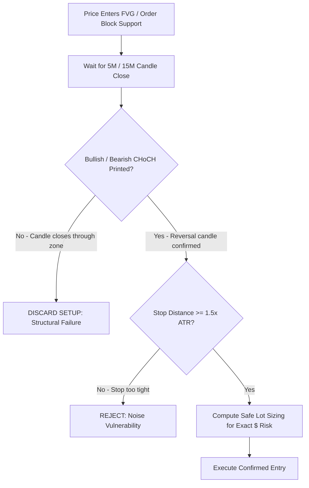

# Regime Detection, Strategy Selection & Entry Confirmation (v3.0.0)

The **Market Regime Engine** and **Strategy Selection Specialist** classify market context across multi-timeframe structures, enforce strict entry confirmation filters, and mandate dynamic bi-directional trend adaptability.

---

## 1. 10 Institutional Market Regimes

| Regime | Definition | Typical ATR Percentile | Favored Strategy Families |
| :--- | :--- | :--- | :--- |
| `STRONG_UPTREND` | Price printing clear Higher Highs (HH) & Higher Lows (HL) above 20 & 50 EMA on HTF & ITF. | $40\text{th} - 70\text{th}$ | Trend Following, Pullback Continuation |
| `WEAK_UPTREND` | Upward drift with frequent deep overlapping retracements; momentum decelerating. | $20\text{th} - 50\text{th}$ | Pullback Continuation, Range / Mean Reversion |
| `STRONG_DOWNTREND` | Lower Lows (LL) & Lower Highs (LH) below 20 & 50 EMA on HTF & ITF; high sell volume. | $40\text{th} - 70\text{th}$ | Trend Following Short, Pullback Short |
| `WEAK_DOWNTREND` | Downward drift with overlapping rallies; declining seller participation. | $20\text{th} - 50\text{th}$ | Short Pullback, Range Support/Resistance |
| `RANGE` | Clear, bounded oscillation between defined Value Area High (VAH) & Low (VAL). | $20\text{th} - 50\text{th}$ | Mean Reversion, Range Boundary Fades |
| `SIDEWAYS / COMPRESSION` | Narrow price consolidation, contracting ATR, Bollinger Bands squeezing inside Keltner. | $< 25\text{th}$ (Low) | Volatility Breakout (Staging only, no active trade) |
| `BREAKOUT` | High-volume candle close outside multi-session range or structural swing point. | $> 65\text{th}$ (High) | Breakout & Momentum Continuation |
| `HIGH_VOLATILITY` | Realized volatility expanding rapidly ($> 85\text{th}$ percentile); wide price swings. | $> 85\text{th}$ (Extreme) | Volatility Breakout, Event-Driven (Risk-Adjusted) |
| `LOW_VOLATILITY` | Stagnant price movement, low volume, flat EMAs. | $< 15\text{th}$ (Extremely Low) | NO TRADE (Capital Preservation) |
| `EVENT_DRIVEN` | High-impact economic news, rate decisions, or earnings releases within $\pm 30\text{ mins}$. | Spiking | EVENT BLACKOUT (Zero trades permitted) |

---

## 2. Confirmation Entry Protocol (No Blind Limit Retests)

> [!IMPORTANT]
> **Anti-Falling-Knife Mandate**: The firm **never** places blind limit orders into falling support or rising resistance.

### Confirmation Checklist:
1. **Candle Close Validation**: A candle on the Lower Timeframe (LTF: 5M or 15M) must close in the intended trade direction before an entry is triggered.
2. **Rejection Wick / Sweep**: The candle must show structural absorption (wick sweep of local liquidity).
3. **Change of Character (CHoCH)**: Break of the most recent micro swing high (for Longs) or swing low (for Shorts).

---

## 3. Bi-Directional Trend Flipping (Short / Sell Capability)

* If a high-timeframe `UPTREND` fails and breaks below the key intraday swing low ($4,620 on Gold):
  1. The Regime Engine **immediately flips the regime to `STRONG_DOWNTREND`**.
  2. The strategy switches from looking for buys to hunting **Short / Sell on Rallies into Supply Zones / Bearish FVGs**.
  3. No stubborn buying is permitted in a confirmed distribution cascade.

---

## 4. 2-Strike Asset Lockout Rule

* If **2 consecutive losing trades** occur on the same instrument:
  - The asset is placed under an **automated 60-minute trading lockout**.
  - All automated scans on that asset are paused to prevent overtrading and revenge trades.
  - The Quantitative Team must conduct a full regime re-assessment before unlocking.
