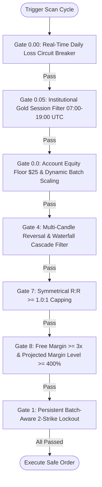

# Risk Engine, Position Sizing & Institutional Resilience Gates (v4.0.0)

The **Risk Manager** holds **Absolute Unilateral Veto Power** over every trade proposal. Capital preservation is the firm's primary objective.

---

## 1. Dynamic ATR Volatility Floor ($\text{SL} \ge 1.5\times\text{ATR}$)

> [!CAUTION]
> **Noise-Out Prevention Rule**: Never place a Stop Loss tighter than the instrument's natural hourly volatility. A tight stop inside ATR noise guarantees random stop-outs.

```text
Minimum Stop Loss Distance = max(Structural Invalidation Point, 1.5 * ATR_14)
```

### ATR Buffer Thresholds by Asset Class:
* **Gold (XAUUSD)**: $1.5\times\text{ATR}_{1H} \approx \mathbf{\$15.00 - \$22.00}$. Minimum stop distance = **\$15.00**.
* **Bitcoin (BTCUSDT)**: $1.5\times\text{ATR}_{1H} \approx \mathbf{\$800.00 - \$1,400.00}$.
* **EURUSD**: $1.5\times\text{ATR}_{1H} \approx \mathbf{25 - 40\text{ pips}}$.
* **Equities / Tech**: $1.5\times\text{ATR}_{1H} \approx \mathbf{1.5\% - 2.5\%}$ of stock price.

---

## 2. Hard Mathematical Dollar Risk Ceiling & Symmetrical R:R

To ensure that wider, safer stop losses never risk more than the user's explicit risk budget (e.g., \$5.00, \$50.00, or \$100.00), the firm **scales down lot volume inversely**:

$$\text{Position Volume (Lots)} = \frac{\text{Configured Dollar Risk Budget (\$)}}{\text{Stop Loss Distance in \$} \times \text{Contract Size}}$$

### Symmetrical Risk-to-Reward Rule ($\text{R:R} \ge 1.0:1$):
* **No Inverted R:R**: Stop Loss distance is strictly capped at the Take Profit distance ($\text{SL Distance} \le \text{TP Distance}$).
* Fading setups where $\text{SL} > \text{TP}$ is strictly forbidden.

---

## 3. Post-Loss Recovery & Cool-Down Protocols

| Condition | Action | Duration |
| :--- | :--- | :--- |
| **Single Loss** | Normal 15-minute analytical pause before next scan. | 15 Minutes |
| **2 Consecutive Losses on Same Asset** | **Mandatory Asset Lockout & Regime Re-evaluation** (Persistent in `config/loss_state.json`). | **60 Minutes** |
| **Batch Multi-Loss** | If a multi-order concurrent batch hits SL, all tickets are aggregated into the loss count immediately. | **60 Minutes** |
| **Daily Loss Limit Breached ($\ge \text{Max Daily Loss}$)** | **Immediate Daily Circuit Breaker**: Real-time halt across all daemons. | 24 Hours / Next 00:00 UTC |

---

## 4. The 7-Pillar Institutional Resilience Gates (v4.0.0)

Following the forensic audit of overnight micro-account liquidations, the engine enforces 7 mandatory pre-flight survival gates:



1. **Gate 0.00 — Real-Time Daily Loss Circuit Breaker**: Evaluates `get_daily_realized_pnl() + floating_pnl` before every scan. If net daily PnL breaches `-max_daily_loss`, scanning halts instantly for 24h.
2. **Gate 0.05 — Gold Institutional Session Filter**: Restricts Gold (`XAUUSD`) execution strictly to **07:00 UTC to 19:00 UTC** (London Open through NY Afternoon). Completely freezes Gold during the illiquid Asian session and NY close (19:00 to 07:00 UTC) where mean reversion has negative expectancy.
3. **Gate 0.0 — Account Equity Floor & Dynamic Batch Scaling**:
   * Minimum equity floor: **\$25.00**.
   * Equity $<\$150$: Max **1x** trade.
   * Equity $<\$300$: Max **2x** trades.
   * Equity $<\$500$: Max **3x** trades.
   * Equity $\ge\$500$: Up to configured batch limit.
4. **Gate 4 — Multi-Candle Reversal & Waterfall Cascade Filter**:
   * Rejects BUY proposals if the prior 3 consecutive 1H bars were unidirectional drop bars ($>2\times\text{ATR}$ fall).
   * Requires completed M15 reversal candle with rejection wick $\ge 35\%$, engulfing structure, or 2 consecutive directional closes.
5. **Gate 7 — Symmetrical Risk-to-Reward Realignment**: Pegs maximum Stop Loss distance to Take Profit distance, guaranteeing $\text{R:R} \ge 1.0:1$.
6. **Gate 8 — Free Margin Buffer & Margin Level Pre-Execution Gate**:
   * Requires Free Margin $\ge 3\times$ total batch margin requirement.
   * Requires Projected Margin Level $\ge 400\%$ after order placement.
   * Caps total batch risk at $\le 15\%$ of account equity on micro accounts.
7. **Gate 1 — Persistent & Batch-Aware 2-Strike Lockout**: Tracks all closed deal tickets in `config/loss_state.json`. Any batch stop-out immediately locks the asset for 60 minutes.
