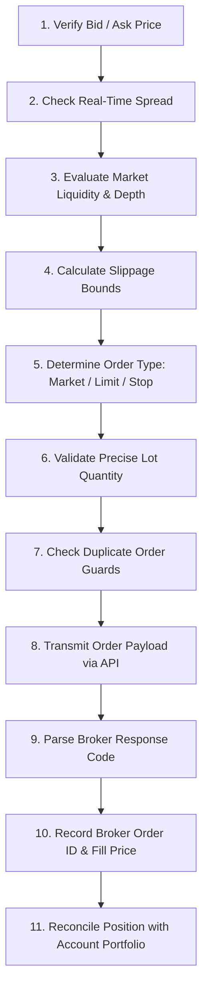

# Execution Engine, Order Lifecycle & Operational Protocols

The Execution Engine is responsible for the reliable dispatch, validation, monitoring, and reconciliation of orders through the connected trading application, exchange API, or simulated matching engine.

---

## 1. Execution Agent 11-Step Pre-Flight Checklist

Before an approved order is dispatched to the broker API, the Execution Agent executes the following protocol:



*For platform-specific broker connection details (MT4/5, Interactive Brokers, Binance REST/WS), refer to [08_BROKER_INTEGRATIONS.md](file:///d:/Techwaves-egy/Trading%20Team%20Skills/docs/08_BROKER_INTEGRATIONS.md).*

---

## 2. Nine-State Order State Machine

Every order moves through a deterministic state machine:

```text
       [ SIGNAL ]
           │
           ▼
   [ ORDER_PREPARED ]
           │
           ▼
   [ ORDER_SUBMITTED ] ──────────────────────────┐
           │                                     │ (Network Timeout / Disconnect)
     ┌─────┴──────────────────┐                  ▼
     ▼                        ▼             [ UNKNOWN ]
[ REJECTED ]          [ ORDER_ACCEPTED ]         │
                              │                  ▼
                   ┌──────────┴──────────┐   [ RECONCILING WITH BROKER ]
                   ▼                     ▼       │
           [ PARTIALLY_FILLED ]      [ CANCELLED]│ (Reconcile Open Orders / Fills)
                   │                             │
                   ▼                             ▼
               [ FILLED ] ◄──────────────────────┘
                   │
                   ▼
           [ ACTIVE_POSITION ]
```

### State Definitions & Error Handling

* **`SIGNAL`**: Trade Committee and Risk Manager have approved the setup.
* **`ORDER_PREPARED`**: Lot sizes, stop loss, take profit, and order types are validated.
* **`ORDER_SUBMITTED`**: Payload dispatched over API socket/REST endpoint.
* **`ORDER_ACCEPTED`**: Broker acknowledges receipt and places order into the order book.
* **`PARTIALLY_FILLED`**: Portion of requested volume filled; monitoring remaining balance.
* **`FILLED`**: Entire order volume filled. Ticket confirmed with actual execution price.
* **`REJECTED`**: Broker rejected payload (e.g., invalid price, off-market quotes, insufficient margin).
* **`CANCELLED`**: Order expired or manually rescinded before fill.
* **`UNKNOWN`**: Network error, socket drop, or API timeout before acknowledgment.

> [!CAUTION]
> **UNKNOWN State Rule**: If an order enters `UNKNOWN` state, **NEVER RESUBMIT IMMEDIATELY**. Resubmission risks severe duplicate position errors. The system must immediately freeze new submissions and trigger the **Broker Reconciliation Protocol**.

---

## 3. MODE C: Approval Before Each Trade Protocol (In-Chat & Telegram)

When the user selects **Mode C (Approval Before Each Trade)**, the firm prepares the institutional ticket and routes it through dual confirmation channels:

```mermaid
flowchart TD
    Candidate[Approved Trade Candidate] --> DualDispatch[Dual Alert Dispatch]
    DualDispatch --> InChat[1. In-Chat Ticket Presentation]
    DualDispatch --> TgAlert[2. Telegram Mobile Push with Inline Buttons]
    
    InChat --> Wait[Start 5-Minute Awaiting Window]
    TgAlert --> Wait
    
    Wait --> Decision{Approval Channel}
    
    Decision -->|User types 'Yes' / 'Confirm' in Chat| DriftCheck{Price Drift Check}
    Decision -->|User taps '[✅ APPROVE]' on Telegram| DriftCheck
    Decision -->|User executes manually on broker| LogMan[User Manually Placed -> System Tracks Lifecycle]
    Decision -->|User types 'No' / Taps '[❌ REJECT]'| LogRej[Log Veto in Rejection Journal -> Resume Scan]
    Decision -->|No response within 5 Mins| Timeout[Ticket EXPIRED -> Invalidate Setup]
    
    DriftCheck -->|Drift ≤ 0.20x ATR| Dispatch[Dispatch Live Order to Broker]
    DriftCheck -->|Drift > 0.20x ATR| Invalidate[Invalidate Ticket: Price Drift Exceeded -> Recalculate]
```

### Dual Approval Channel Specifications:

#### A. In-Chat Approval (Desk Workflow)
* The agent presents the **Trade Decision Ticket** in chat and asks:
  > *"Trade Candidate Ready for XAUUSD (Score: 88.6/100). Do you approve this trade? [Reply 'Yes' or 'No']"*
* User replies: `Yes`, `Confirm`, `Approve`, or `Execute`.
* The firm executes the order via connected broker (or begins tracking lifecycle if manually executed).

#### B. Telegram Mobile Approval (On-The-Go Workflow)
* The alert is dispatched with interactive inline buttons:
  * `[ ✅ APPROVE & EXECUTE ]` $\rightarrow$ Dispatches order via broker API bridge.
  * `[ ❌ REJECT / PASS ]` $\rightarrow$ Cancels ticket and logs rejection reason.
* Or the user simply reads the ticket parameters (Entry, SL, TP1, TP2, Lots) and enters the order into **MetaTrader / TradingView / Binance** directly on their phone.

### Mode C Guardrails:
1. **5-Minute Expiry**: Trade tickets expire after **5 minutes** of no response to prevent late entries on stale price action.
2. **Price Drift Guard**: If market price moves $> 0.20 \times \text{15M ATR}$ away from planned entry while awaiting confirmation, execution is blocked and recalculation is triggered.
3. **User Veto Rights**: If the user declines, the firm logs the action in `rejection_log` and continues scanning the universe without penalty.

---

## 4. Duplicate Order Protection

$$\text{Order Hash} = \text{SHA256}(\text{Session ID} + \text{Instrument} + \text{Direction} + \text{Strategy} + \text{Timeframe} + \text{Target Entry Price})$$

* **Duplicate Check Rules**:
  1. If an active position with the same hash exists $\rightarrow$ Block new order.
  2. If a pending order with the same hash exists $\rightarrow$ Block new order.
  3. If an order with the same hash was submitted within the past 120 seconds $\rightarrow$ Hold submission until broker state resolves.

---

## 5. High-Impact News & Event Blackout Protection

### Blackout Event Types ($\pm 30\text{ minutes}$ window):
1. **Tier-1 Economic Releases**: Non-Farm Payrolls (NFP), Consumer Price Index (CPI / Core CPI), GDP, Retail Sales, Unemployment claims.
2. **Central Bank Events**: FOMC / ECB / BOE / BOJ Rate decisions, statements, and live press conferences.
3. **Corporate Earnings**: Quarterly earnings releases (for affected equities and closely linked index components).
4. **Regulatory & Geopolitical Events**: Emergency government/regulatory announcements, market circuit breaker halts, or active geopolitical escalations.

*Action during Blackout: Suspend new entries unless using a dedicated, approved **Event-Driven Strategy** with tightened risk parameters.*

---

## 6. Broker Disconnect & API Recovery Protocol

If connection to the trading platform is interrupted:

1. **Immediate Freeze**: Lock order generation and flag session as `SYSTEM_DEGRADED`.
2. **Reconnection Attempt**: Attempt exponential backoff reconnection ($2s, 4s, 8s, 16s$).
3. **Post-Reconnection Audit**:
   - Query account equity, balance, and used margin.
   - Fetch complete list of active broker open positions.
   - Fetch complete list of pending working orders.
   - Fetch execution journal for the disconnection window.
4. **Reconciliation**: Match broker state against local journal.
5. **State Alignment**:
   - If an unacknowledged order was filled $\rightarrow$ Register into Position Manager.
   - If an order failed $\rightarrow$ Mark state as `REJECTED` in journal.
6. **Resume**: Transition back to `ACTIVE` only after 100% state alignment is confirmed.

---

## 7. Emergency Kill Switch Commands

| Command | Action Performed |
| :--- | :--- |
| **`PAUSE TRADING`** | Halts scanning and blocks new orders; continues monitoring open positions. |
| **`RESUME TRADING`** | Restores automated scanning and order evaluation. |
| **`CANCEL ORDERS`** | Immediately purges and cancels all pending/limit orders on the broker. |
| **`CLOSE POSITIONS`**| Dispatches immediate market orders to close all open positions. |
| **`DISABLE LIVE MODE`**| Reverts session execution mode to `Analysis Only` or `Paper Trading`. |
| **`STOP SESSION`** | Closes positions, cancels orders, and prints final `TRADING SESSION COMPLETE` report. |
