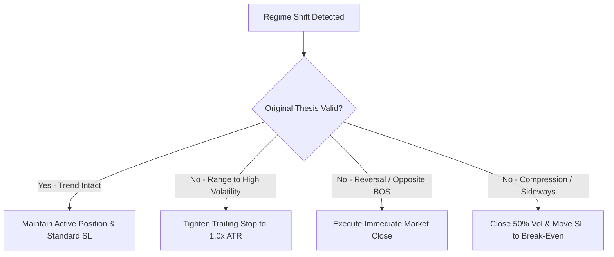

# Position Management, Scale-Out & Trade Lifecycle Rules

Once a trade candidate is executed and confirmed, primary authority transitions from the Execution Agent to the **Position Management Team**. The team executes active risk management and dispatches real-time milestone guidance.

---

## 1. Multi-Stage Scale-Out & Take-Profit Matrix

To lock in unrealized profits while maintaining exposure to asymmetric trend expansions, all directional positions use a 3-tier scaled exit model:

```text
[ ENTRY ] ────────► [ TP1: 1.0R to 1.5R ] ────────► [ TP2: 2.0R to 2.5R ] ────────► [ RUNNER: Structural Target ]
                     • Close 40% Volume              • Close 40% Volume              • Hold 20% Volume
                     • Move SL to Break-Even + Spread • Move SL to TP1 Level          • Trail Stop until Invalidation
```

### Tier Specifications

| Stage | Target Level | Position Volume Action | Stop-Loss Adjustment | Purpose |
| :--- | :--- | :--- | :--- | :--- |
| **Tier 1 (TP1)** | $1.0\text{R}$ to $1.5\text{R}$ Gain | **Close 40%** of initial volume | Move SL to **Entry Price $\pm$ Spread Buffer** (Risk-Free) | Guarantees trade cannot become a loss; pays commissions. |
| **Tier 2 (TP2)** | $2.0\text{R}$ to $2.5\text{R}$ Gain | **Close 40%** of initial volume | Move SL to **TP1 Price level** (Lock in $\ge 1.0\text{R}$) | Banks majority of expected value from setup. |
| **Tier 3 (Runner)** | Structural Liquidity Pool / HTF Level | **Hold remaining 20%** volume | Dynamic trailing stop ($2.0\times$ ATR or structural swing) | Captures macro trend expansions and outlier runs. |

*Note: For Mean Reversion and Range strategies, positions are closed 100% at the opposite range boundary / mean (VPOC).*

---

## 1.1. 80/70 Asymmetric Profit Protection Protocol (v3.8.0)

To mathematically eliminate the risk of substantial winning trades reversing back into break-even or a loss during sudden adverse market swings, the firm implements the **80/70 Asymmetric Profit Protection Protocol**:

```text
[ ENTRY: 0% ] ────────► [ ARMED THRESHOLD: ≥ 80% TP ] ────► [ RETRACEMENT TRIGGER: ≤ 70% TP ]
                             • Record Peak Progress              • Close 100% Volume at Market
                             • Arm Profit Guard                  • Lock In Gain as Win
```

### Protocol Specifications:
1. **Target Distance Calculation**:
   * **BUY Trade**: $\text{Total Distance} = P_{\text{tp}} - P_{\text{entry}}$; $\text{Progress} = \frac{P_{\text{current}} - P_{\text{entry}}}{\text{Total Distance}}$.
   * **SELL Trade**: $\text{Total Distance} = P_{\text{entry}} - P_{\text{tp}}$; $\text{Progress} = \frac{P_{\text{entry}} - P_{\text{current}}}{\text{Total Distance}}$.
2. **Phase 1: Arming Gate ($\ge 80\%$)**:
   * Once trade progress reaches $\ge 80\%$ ($0.80$) of the distance to the active Take Profit target, the position is automatically marked **ARMED** by `trade_monitor.py`.
3. **Phase 2: Retracement Exit ($\le 70\%$)**:
   * If price subsequently turns around and retraces back to $\le 70\%$ ($0.70$) of the TP distance, the daemon dispatches an immediate market close order (`close_position(ticket)`).
   * **Benefit**: Guarantees that at least $70\%$ of the initial TP value is permanently banked, shielding capital from sharp market rejections just shy of full target.
4. **Instant Telegram Broadcast**:
   * Emits an immediate high-priority alert detailing the peak progress, retracement trigger level, and exact realized profit.

---

## 2. Real-Time TP & SL Manual Action Dispatch Protocol

If the trader is executing orders manually on their phone or broker terminal, the Position Management Team dispatches **immediate step-by-step action alerts** to Telegram and Desktop Chat at every critical milestone:

### A. Take Profit 1 (TP1) Milestone Dispatch:
* **Trigger**: Price touches or crosses the TP1 price target.
* **Dispatched Message**:
  ```text
  🎯 TAKE PROFIT 1 (TP1) REACHED! — [Asset]
  👉 ACTION: 1. Close 40% volume at market.
            2. Move Stop Loss to Entry Price (Break-Even).
  🔒 Trade is now completely Risk-Free!
  ```

### B. Take Profit 2 (TP2) Milestone Dispatch:
* **Trigger**: Price touches or crosses the TP2 price target.
* **Dispatched Message**:
  ```text
  🎯🎯 TAKE PROFIT 2 (TP2) REACHED! — [Asset]
  👉 ACTION: 1. Close another 40% volume at market.
            2. Move Stop Loss up to TP1 Level (Lock +1.5R profit).
            3. Let 20% Runner ride on trailing stop.
  ```

### C. Stop Loss (SL) Invalidation Dispatch:
* **Trigger**: Price touches or breaches the hard invalidation level.
* **Dispatched Message**:
  ```text
  🛑 STOP LOSS HIT — [Asset]
  👉 ACTION: 1. Confirm position is 100% closed on broker.
            2. Purge attached pending limit orders.
  ⏳ 30-Minute Cool-down protocol activated.
  ```

---

## 3. Dynamic Trailing Stop Methodologies

The Position Manager selects the trailing stop method that aligns with the active strategy family:

### A. Structural Trailing Stop (Default for Trend Following & Pullback)
* **Rule**: Stop is trailed behind the most recent confirmed swing low (for Longs) or swing high (for Shorts) on the Intermediate Timeframe (ITF: 1H/30M).
* **Validation**: A new swing point is confirmed only after a closed candle prints in the direction of the trend.

### B. Volatility Trailing Stop (Default for Momentum & Breakout)
* **Rule**: $\text{Trailing Stop} = \text{Highest High Since Entry} - (2.0 \times \text{ATR}_{14})$.
* **Update Frequency**: Calculated upon each candle close on the Lower Timeframe (LTF: 15M).
* **Directionality**: Trailing stops only move in the direction of profit; they are never widened.

### C. Time-Based / Session Exhaustion Trailing
* **Rule**: If a trade fails to reach TP1 within **6 consecutive 1H candles** (stagnation), tighten SL to $1.0\times$ ATR from current price to prevent capital lockup.

---

## 4. Mid-Trade Market Regime Shift Protocols

If the Market Regime Engine detects a shift while a position is active:



---

## 5. Time-Based & Session Closure Mandates

* **Weekend & Daily Roll Blackout**:
  - Forex/Metals: Close intraday positions or tighten stops 30 minutes prior to daily rollover (**5:00 PM New York Time / Eastern Time**) to avoid spread widening and swap charges.
  - Crypto: No rollover blackout; enforce standard structural stops.
* **Pre-News Exit Rule**:
  - If an active position has not reached TP1 prior to an impending Tier-1 economic release ($\le 15\text{ mins}$ before release), close position or lock SL at Break-Even.
