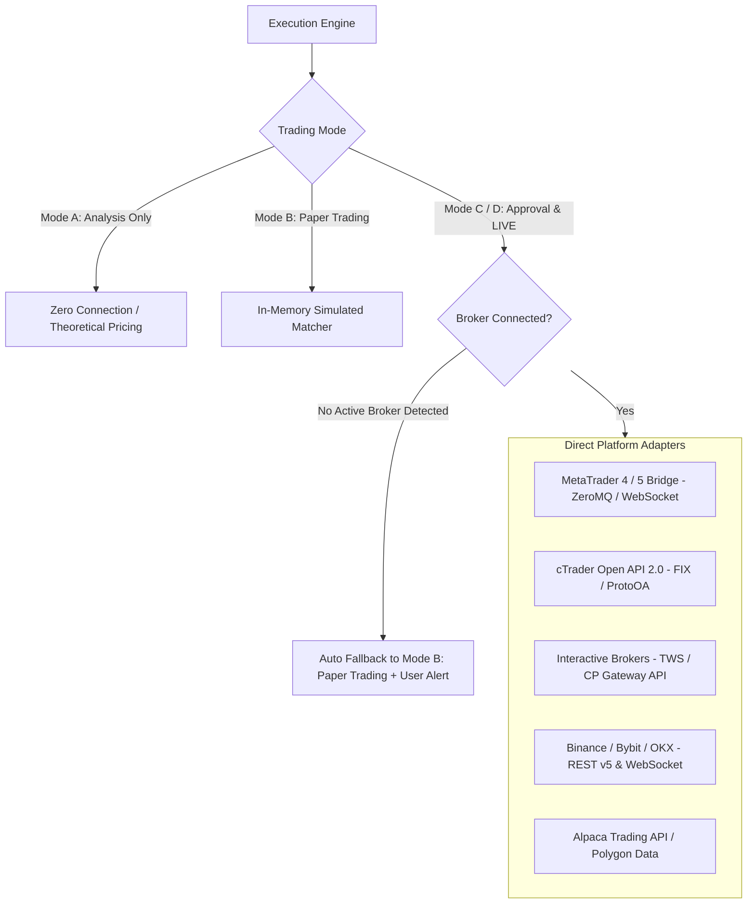

# Broker & Exchange API Integrations and Execution Routing

The Execution Engine supports multiple broker interfaces, API protocols, and fallback simulation models to execute trades across diverse asset classes.

---

## 1. Supported Connectivity Architectures



---

## 2. Unconfigured Broker Fallback Policy

If the user requests **`MODE D: LIVE Autonomous Trading`** or **`MODE C: Approval Before Each Trade`** but no live broker adapter or credentials are configured:

```text
FALLBACK PROTOCOL:
1. Detect unconfigured broker connection during Phase 1 pre-flight check.
2. Emit User Notice:
   "⚠️ Notice: No live broker adapter configured. Reverting session to MODE B: Paper Trading."
3. Transition Execution Engine to In-Memory Simulated Matcher.
4. Continue full multi-agent scanning, regime classification, committee voting, and paper order tracking.
```

---

## 3. Platform Adapter Specifications

### A. MetaTrader 4 / MetaTrader 5 (Forex, Metals, Indices)
* **Interface**: Local WebSocket / ZeroMQ Python Bridge connecting to terminal Expert Advisor (EA).
* **Telemetry**:
  - `account_info()`: Balance, Equity, Margin, Free Margin.
  - `positions_get()`: Active tickets, open prices, SL, TP, swap.
  - `order_send()`: Sends `TRADE_ACTION_DEAL` with slippage deviation tolerance ($\le 10$ points).

### B. Interactive Brokers (Equities, Futures, Options)
* **Interface**: `ib_insync` / Official TWS API on port `7496` (Live) / `7497` (Paper).
* **Telemetry**:
  - `reqAccountSummary()`: Net liquidation value, available funds.
  - `placeOrder()`: Bracket orders enclosing parent limit/market with attached Stop Loss and Take Profit child orders.

### C. Crypto Exchanges (Binance, Bybit, OKX)
* **Interface**: REST API v3/v5 for order dispatch + WebSocket for 100ms real-time book tickers.
* **Security**: API Keys stored as environment variables (`BINANCE_API_KEY`, `BINANCE_API_SECRET`). IP-whitelisted, zero-withdrawal permission.
* **Order Payload**: `POST /fapi/v1/order` with `workingType="MARK_PRICE"` to prevent liquidation stop-hunts.

### D. In-Memory Simulated Engine (Paper Trading Mode)
* Fills paper orders at the current real-time bid/ask quote.
* Applies a simulated slippage penalty ($0.5\text{ to }1.5\text{ pips}$ depending on volatility).
* Calculates hypothetical P&L, commissions, and swaps with full journal fidelity.

---

## 4. Pre-Flight Connection Diagnostics & Safety Checks

Before dispatching live orders in `MODE D`, the Execution Agent runs a mandatory 6-step handshake:

```text
HANDSHAKE PROTOCOL:
1. Ping Broker API endpoint -> Response latency < 250ms.
2. Query Account Permissions -> Confirm TRADE capability (Read/Write).
3. Confirm Account Equity -> Equity > $0 and Margin Level > 200%.
4. Query Open Symbol Specification -> Confirm Lot Step, Min Lot, Contract Multiplier.
5. Check Market Status -> Market session is OPEN for trading.
6. Verify Rate Limit Headroom -> API budget utilization < 60%.
```

*If ANY handshake step fails $\rightarrow$ Session reverts immediately to `MODE B: Paper Trading`.*
