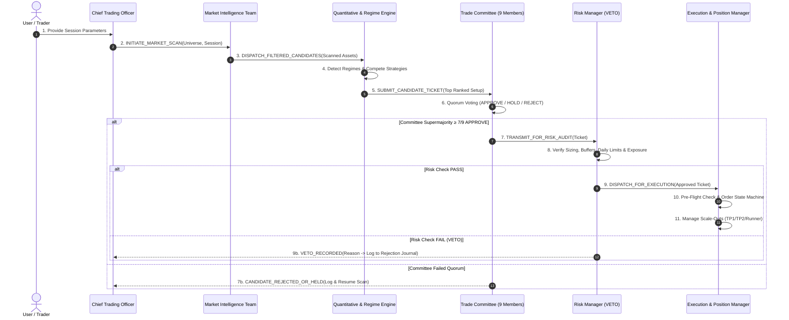

# Inter-Agent Communication Protocols & Pipeline Sequencing

To maintain synchronization across the 16 specialized roles without cognitive clutter or race conditions, the Autonomous Trading Firm utilizes a structured, deterministic communication pipeline.

---

## 1. Multi-Agent Pipeline Sequencing



---

## 2. Standardized Message Payloads

### A. Intelligence $\rightarrow$ Quant Handoff (`SCAN_PAYLOAD`)
```json
{
  "message_type": "SCAN_PAYLOAD",
  "timestamp": "2026-08-24T13:00:00Z",
  "instrument": "XAUUSD",
  "data_integrity": "VALID (Latency: 45ms, Spread: 0.12 pts)",
  "macro_bias": "BULLISH (Real yields declining, DXY softening)",
  "technical_summary": "Price above 20/50/200 EMA, RSI 62, 1H FVG mitigation",
  "structure_summary": "HH/HL sequence intact; unmitigated bullish order block @ 2652",
  "news_status": "CLEAR (No Tier-1 news within 45 mins)"
}
```

### B. Quant Engine $\rightarrow$ Trade Committee (`CANDIDATE_SUBMISSION`)
```json
{
  "message_type": "CANDIDATE_SUBMISSION",
  "ticket_id": "CAND-20260824-001",
  "instrument": "XAUUSD",
  "detected_regime": "STRONG_UPTREND",
  "selected_strategy": "Pullback_Continuation",
  "composite_strategy_score": 86.5,
  "factor_floors_passed": true,
  "planned_entry": 2652.50,
  "planned_stop": 2646.50,
  "planned_tp1": 2661.50,
  "planned_tp2": 2667.50,
  "expected_rr": 2.50
}
```

### C. Trade Committee $\rightarrow$ Risk Manager (`COMMITTEE_VOTE_RESULT`)
```json
{
  "message_type": "COMMITTEE_VOTE_RESULT",
  "ticket_id": "CAND-20260824-001",
  "quorum_status": "SUPERMAJORITY_ACHIEVED",
  "vote_tally": {
    "APPROVE": 8,
    "HOLD": 1,
    "REJECT": 0
  },
  "dissenting_notes": "Quant analyst held for 15M candle close; overridden by supermajority."
}
```

### D. Regime Engine $\rightarrow$ Position Manager Alert (`REGIME_SHIFT_ALERT`)
```json
{
  "message_type": "REGIME_SHIFT_ALERT",
  "active_trade_id": "TRD-20260824-001",
  "instrument": "XAUUSD",
  "prior_regime": "STRONG_UPTREND",
  "new_regime": "HIGH_VOLATILITY",
  "mandated_action": "TIGHTEN_TRAILING_STOP_TO_1.0x_ATR"
}
```

---

## 3. Communication Safeguards & Concurrency Controls

1. **Deterministic Handoffs**: No agent acts on an unconfirmed message. Every handoff contains a cryptographic timestamp and unique ticket ID.
2. **Single Active Review**: The Trade Committee reviews exactly one primary candidate at a time to prevent fragmented attention and cross-asset execution collisions.
3. **Immutable Logging**: All inter-agent payloads are preserved in the session audit memory to enable post-session performance analytics and compliance auditing.
