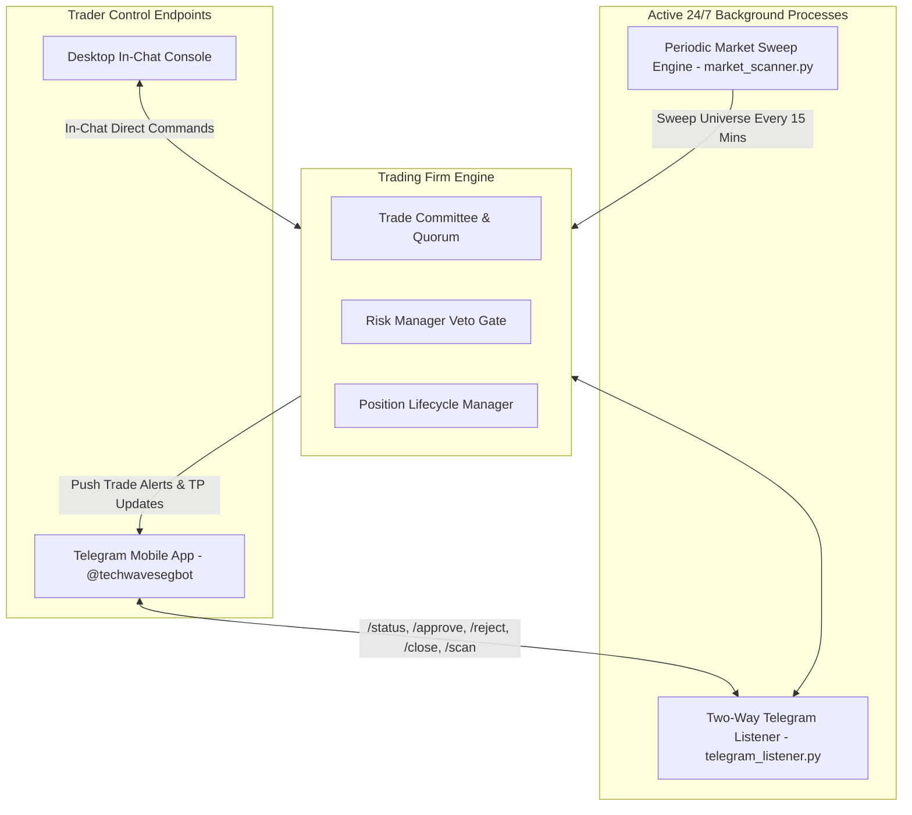

# Background Monitoring, Real-Time Chat Listening & Scheduled Sweeps

The AI Autonomous Trading Firm includes persistent background daemons and recurring sweep engines that enable 24/7 autonomous market monitoring, continuous chat listening, and immediate mobile remote control.

---

## 1. Architecture Overview



---

## 2. Two-Way Telegram Mobile Commands Reference

The background listener continuously monitors incoming messages and callback button taps from your Telegram channel or direct bot chat:

| Mobile Command | Functionality & Action Taken |
| :--- | :--- |
| **`/status`** | Returns live telemetry: active open positions, entry prices, realized/unrealized P&L, stop loss levels, and next Take Profit targets. |
| **`/approve`** *(or tap `[APPROVE]`)* | Confirms and executes the currently pending trade ticket on your broker bridge (or logs manual execution). |
| **`/reject`** *(or tap `[REJECT]`)* | Rejects and discards the pending candidate, logging the reason in the Rejection Audit Journal. |
| **`/scan`** | Forces an immediate multi-agent market sweep across the configured asset universe. |
| **`/close`** | Emergency kill switch: Dispatches immediate market orders to close all open positions. |
| **`/pause`** | Pauses automated scanning while maintaining open position trailing stops. |
| **`/resume`** | Resumes autonomous scanning and candidate evaluation. |
| **`/help`** | Displays the complete list of mobile commands on your phone. |

---

## 3. Automated Periodic Market Sweeps (`market_scanner.py`)

The scanner engine runs background sweeps on a configurable interval (e.g., 15 minutes, 30 minutes, or 1 hour):

### Sweep Execution Lifecycle:
1. **Fetch Latest Price Action**: Queries 4H, 1H, and 15M candles for all assets in the active universe.
2. **Evaluate Liquidity & Spreads**: Filters out instruments with spreads $> 0.10 \times \text{ATR}$ or pending news blackouts ($\pm 30\text{ mins}$).
3. **Classify Regimes**: Assigns market regimes across all timeframes.
4. **Run Strategy Tournament**: Competes 8 strategy families.
5. **Score & Filter**:
   - If composite score $< 75.0$ $\rightarrow$ Stays silent (no spam).
   - If composite score $\ge 75.0$ and clears all factor floors $\rightarrow$ Passes to Trade Committee & Risk Gate.
6. **Dispatch Alert**: Instantly forwards the **Trade Decision Ticket** with interactive `[APPROVE]` buttons to Telegram and Desktop Chat.

---

## 4. Daemon Management Commands

You can control background daemons anytime via terminal or script execution:

```bash
# Start Telegram Two-Way Listener Daemon
python scripts/telegram_listener.py

# Start Background Market Scanner (e.g. 15-minute sweep interval)
python scripts/market_scanner.py 15

# View Masked Saved Credential Status
python scripts/config_manager.py status

# Dispatch Manual Test Alert to Phone
python scripts/send_alert.py --test
```
