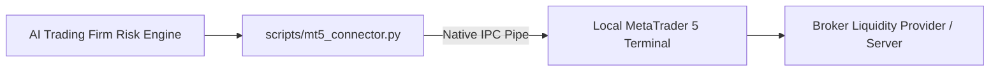

# MetaTrader 4/5 & TradingView Integration Architecture

The AI Autonomous Trading Firm provides direct API bridges, local terminal IPC connectors, and webhook servers to integrate seamlessly with **MetaTrader 5 (MT5)**, **MetaTrader 4 (MT4)**, and **TradingView**.

---

## 1. MetaTrader 5 (MT5) Direct Python Integration

MetaTrader 5 provides a high-performance native Python API. The firm connects directly to your local MT5 terminal with zero intermediate middleware.



### Quick MT5 Setup (2 Steps):
1. **Install MetaTrader 5 Python Library**:
   ```bash
   pip install MetaTrader5
   ```
2. **Open MetaTrader 5 Desktop**:
   - Go to **Tools** $\rightarrow$ **Options** $\rightarrow$ **Expert Advisors**.
   - Check **"Allow algorithmic trading"**.
   - Log into your live or demo trading account in the MT5 desktop terminal.

### How MT5 Direct Execution Works:
* When a trade ticket is approved (via In-Chat `"Yes"` or Telegram `[APPROVE]`), [`scripts/mt5_connector.py`](file:///d:/Techwaves-egy/Trading%20Team%20Skills/scripts/mt5_connector.py) executes:
  ```python
  from mt5_connector import execute_mt5_order, modify_mt5_sl

  # Dispatches order with exact calculated lots, SL, and TP
  execute_mt5_order(trade_ticket)

  # Automatically modifies SL to Break-Even when TP1 is hit
  modify_mt5_sl(position_ticket, new_sl=entry_price)
  ```

---

## 2. TradingView Webhook Integration

You can connect TradingView custom alerts, Pine Script indicators, and strategies directly into the AI Trading Firm.

```mermaid
flowchart LR
    TradingView[TradingView Alert / Strategy] -->|POST JSON Webhook| TVServer[scripts/tradingview_bridge.py]
    TVServer --> RiskEngine[Trading Firm Risk Gate]
    RiskEngine --> Dispatch[Dispatches Alert with [APPROVE] to Telegram & MT5]
```

### Step 1: Start the TradingView Webhook Server
Run the local bridge server:
```bash
python scripts/tradingview_bridge.py 5000
```
*(If hosting locally, use a free secure tunnel like [Cloudflare Tunnel](https://developers.cloudflare.com/cloudflare-one/connections/connect-networks/) or [Ngrok](https://ngrok.com/): `ngrok http 5000` to get a public `https://...ngrok-free.app/webhook` URL).*

### Step 2: Configure the Alert in TradingView
1. On any TradingView chart, click **Alerts** (Alt+A) $\rightarrow$ **Notifications**.
2. Check **Webhook URL** and paste:
   ```text
   https://your-public-url/webhook
   ```
3. In the **Message** box, paste this standard JSON payload:
   ```json
   {
     "ticker": "{{ticker}}",
     "action": "BUY",
     "price": "{{close}}",
     "strategy": "Bullish FVG Pullback",
     "sl": "4629.50",
     "tp1": "4652.00",
     "tp2": "4661.00",
     "tp3": "4675.00",
     "lots": "1.11 Lots"
   }
   ```

### What Happens When TradingView Fires:
1. TradingView sends the JSON payload to [`scripts/tradingview_bridge.py`](file:///d:/Techwaves-egy/Trading%20Team%20Skills/scripts/tradingview_bridge.py).
2. The Trading Firm's **Risk Engine** validates the spread, lot bounds, and news blackout window.
3. The firm pushes an instant **Trade Decision Ticket** with interactive `[ ✅ APPROVE & EXECUTE ]` buttons to your Telegram and Desktop Chat!

---

## 3. Ready-to-Paste TradingView Pine Script Indicator (v5)

Copy and paste this script into the **Pine Editor** in TradingView to draw the AI Firm's exact multi-tier scale-out target levels on your charts:

```pinescript
//@version=5
indicator("AI Autonomous Trading Firm — Multi-TP Target Box", overlay=true)

entry_price = input.float(4638.50, title="Planned Entry Price")
sl_price    = input.float(4629.50, title="Stop Loss Level")
tp1_price   = input.float(4652.00, title="TP1 (Close 40% -> SL to BE)")
tp2_price   = input.float(4661.00, title="TP2 (Close 40% -> Lock TP1)")
tp3_price   = input.float(4675.00, title="TP3 Runner Target")

// Plot Visual Lines
plot(entry_price, title="Entry", color=color.blue, linewidth=2, style=plot.style_line)
plot(sl_price, title="Stop Loss", color=color.red, linewidth=2, style=plot.style_line)
plot(tp1_price, title="TP1 (+1.5R)", color=color.green, linewidth=2, style=plot.style_linebr)
plot(tp2_price, title="TP2 (+2.5R)", color=color.lime, linewidth=2, style=plot.style_linebr)
plot(tp3_price, title="TP3 Runner", color=color.teal, linewidth=2, style=plot.style_linebr)
```

---

## 4. Integration Summary

| Platform | Connection Protocol | Capability |
| :--- | :--- | :--- |
| **MetaTrader 5** | Native Python API (`MetaTrader5`) | Direct order execution, automatic SL to Break-Even modification, live equity telemetry. |
| **MetaTrader 4** | ZeroMQ EA / Webhook Bridge | Order routing and ticket tracking. |
| **TradingView** | Inbound HTTP Webhooks (Port 5000) | Receive TradingView custom signals $\rightarrow$ AI Risk Engine $\rightarrow$ Telegram Dispatch. |
